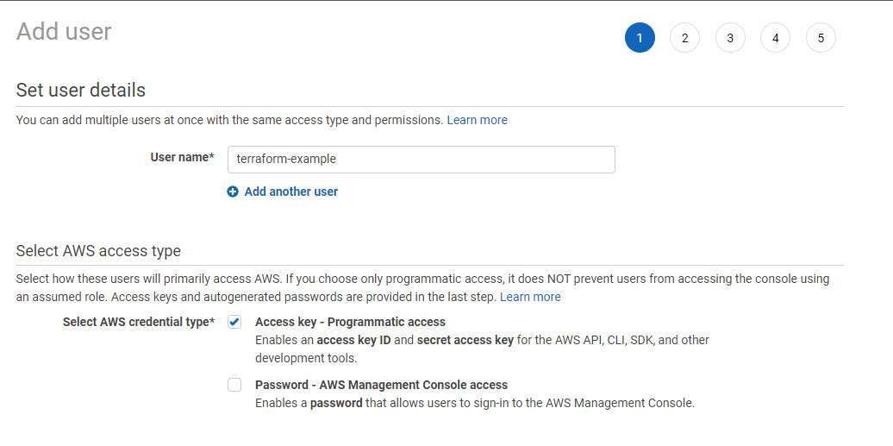

# Instructions

1. Create Terraform IAM user

1. Grant Terraform IAM user access to admin everything (for now)

1. Generate Terraform IAM Keys. (Ideally this would be assumed roles instead, but for demonstration purposes that is beyond this training)

1. Create .env/credentials file with AWS credentials and update backend.tf accordingly

1. Create ssh public & private keys for access later. `ssh-keygen -o -a 100 -t ed25519`

